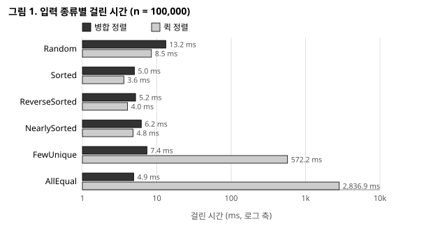
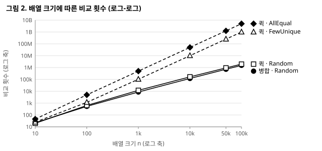
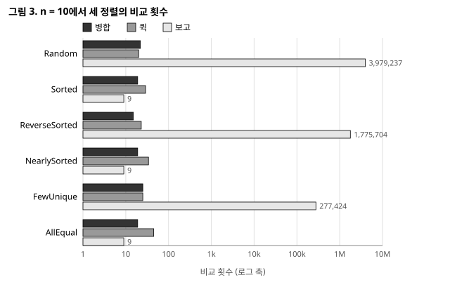
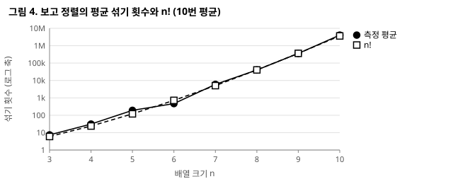

# 정렬 비교 보고서 — 병합 · 퀵 · 보고

<p align="right">배지윤 (2026193117)</p>

수업에서 배운 **병합 정렬**과 **퀵 정렬**, 배우지 않은 **보고 정렬**(bogosort)을 C로 구현하고,
배열 크기와 입력 종류를 바꿔 가며 같은 잣대로 시간 · 메모리 · 비교 횟수를 잰 결과다.

- 저장소: <https://github.com/jiyunb314-dev/algorithm_hw1>
- 구현: [`src/sort.c`](../src/sort.c) (세 정렬) · [`src/data.c`](../src/data.c) (입력 생성) · [`src/main.c`](../src/main.c) (실험)
- 실행: `make run` (실험 전체) · `make test` (유닛 테스트) · `make charts` (그래프)
- 환경: 컨테이너 안 `gcc -std=c17 -Wall -Wextra -O2`

---

## 차례

1. [코드 보고서](#1-코드-보고서) — 무엇을 어떻게 만들었나
2. [알고리즘 상세](#2-알고리즘-상세) — 세 정렬이 실제로 어떻게 도나 (보고 정렬은 AI로 학습한 내용 포함)
3. [알고리즘 실험](#3-알고리즘-실험) — 같은 잣대로 재고 견준 결과

---

## 1. 코드 보고서

설계에서 고른 것과 그 근거, 파일 구성, 그리고 그것이 맞는지 확인한 방법.

### 1.1 설계에서 고른 것

세 정렬을 같은 입력 · 같은 측정 방법으로 비교하는 것이 목표다. 그래서 정렬 함수는 정렬만 하고,
입력 생성(`data.c`)과 측정 · 출력(`main.c`)은 따로 두었다.

| 고민 | 고른 것 | 이유 |
| --- | --- | --- |
| 퀵 정렬의 피벗 | 구간에서 **무작위로** 골라 맨 뒤로 보낸 뒤 Lomuto 분할 | 맨 뒤 원소를 피벗으로 쓰면 이미 정렬된 입력에서 O(n²)이 된다 |
| 퀵 정렬의 재귀 | 두 쪽 중 **작은 쪽만 재귀**하고 큰 쪽은 반복문 | 분할이 치우쳐도 재귀 깊이가 log₂ n + 1을 넘지 않아 스택 오버플로를 막는다 |
| 병합 정렬의 임시 배열 | `merge`가 호출될 때마다 L, R을 만들고 해제 | 구현이 가장 단순하다. 최대 사용량은 마지막 병합의 n칸이다 |
| 보고 정렬의 크기 | n ≤ 10에서만 실행, 더 크면 건너뜀 | 평균 n!번을 섞어야 한다. n = 11이면 약 4천만 번이다 |
| 난수 | xorshift32를 직접 구현한 `Random` 구조체, 씨앗 고정 | 몇 번을 돌려도 같은 입력 · 같은 피벗이 나와 결과가 재현된다 |
| 측정값 | 전역 `SortStats sortStats` 하나에 비교 횟수 · 임시 배열 최대 바이트 · 재귀 깊이 · 섞기 횟수 | 정렬 함수의 인자를 늘리지 않고 잴 수 있다. 정렬 전에 `sortStatsReset()`으로 비운다 |

### 1.2 파일 구조

```text
src/sort.h · sort.c   Random, SortStats, 병합 · 퀵 · 보고 정렬
src/data.h · data.c   generateRandom / Sorted / ReverseSorted / NearlySorted / FewUnique / AllEqual
src/main.c            실험: 배열 크기 × 입력 종류마다 세 정렬을 재고 출력
tests/test_sort.c     유닛 테스트 (표준 C만 사용)
tools/plot.py         results.txt로 그림 1 ~ 4(SVG)를 그린다 (표준 모듈만 사용)
report/results.txt    make run의 전체 출력 (이 보고서의 표와 그림은 모두 여기서 나왔다)
```

`main.c`는 크기 {10, 100, 1,000, 10,000, 50,000, 100,000} × 입력 6가지를 돌며, 같은 입력을
세 번 복사해 병합 · 퀵 · 보고 정렬에 넘긴다. 한 정렬마다 한 줄씩 이렇게 찍는다.

```text
Merge Sort:      13.218 ms, 0.38 MB used,      1536246 compares, depth  17
```

### 1.3 검증

구현이 맞는지 어떻게 확인했나. `make test`의 C 테스트 34개가 모두 통과한다.

| 검사 | 내용 |
| --- | --- |
| 기본 케이스 | 섞임 · 정렬됨 · 역순 · 중복 · 모두 같은 값 · 음수 · 원소 1개 · 빈 배열 (세 정렬 모두) |
| `qsort` 대조 | 무작위 배열 n = 0..300을 표준 라이브러리 `qsort`의 결과와 맞춰 본다 (보고 정렬은 n ≤ 8) |
| 실험 입력 | 여섯 가지 입력(n = 2,000)을 병합 · 퀵 정렬이 모두 정렬하는지, 입력 생성 함수의 값 범위 |
| 이론값 | 병합 정렬: n = 1,024에서 깊이 10, 임시 배열 최대 n칸 / 퀵 정렬: 모두 같은 값에서 비교 n(n-1)/2, 그래도 깊이 ≤ 11 / 보고 정렬: 정렬된 입력은 섞지 않고 비교 n-1번 |
| 재현성 | 보고 정렬: 같은 씨앗이면 섞기 횟수가 같고, 다른 씨앗이면 다르다 |

**테스트가 실제로 잡는지도 확인했다(변이 테스트).** 통과하는 테스트는 아무것도 증명하지
않으므로, 구현을 일부러 바꿔 보고 실패하는지 보았다.

| 바꾼 곳 | 결과 |
| --- | --- |
| 퀵 정렬이 작은 쪽만이 아니라 **양쪽을 모두 재귀**하게 | 검사 **1개** 실패 — "최악에도 깊이 ≤ 11". 정렬 결과는 맞으므로 이 검사가 없으면 모른다 |
| `merge`에서 R을 `arr[mid + 1 + j]` 대신 `arr[mid + j]`로 복사 | 검사 **7개** 실패 |
| 분할 조건 `arr[j] < pivot` → `<=` | 실패 없음. 버그가 아니다. 같은 값을 반대쪽으로 보낼 뿐 정렬은 맞다 |
| 병합 조건 `L[i] <= R[j]` → `<` | 실패 없음. 안정성만 깨지는 변경인데, `int` 배열로는 안정성을 잴 수 없어 잡지 못한다 (3.3 한계) |

---

## 2. 알고리즘 상세

세 정렬이 실제로 어떻게 도는지. 예시는 배열이 한 걸음마다 어떻게 바뀌는지를 따라간다.

### 2.1 병합 정렬

배열을 반으로 나눠 각각 정렬한 뒤, 정렬된 두 반쪽을 병합한다.

```text
[6 2 5 1 7 3 4]
[6 2 5 1]      [7 3 4]        ← mid = left + (right - left) / 2 에서 나눈다
[1 2 5 6]      [3 4 7]        ← 각각 재귀로 정렬
[1 2 3 4 5 6 7]               ← L, R의 앞머리끼리 비교해 작은 쪽을 arr에 채운다
```

병합 조건은 `L[i] <= R[j]`다. **같은 값이면 왼쪽을 먼저 내보내므로** 같은 값의 원래 순서가
유지되는 안정 정렬이 된다.

```c
while (i < n1 && j < n2) {
    if (L[i] <= R[j]) arr[k++] = L[i++];   /* '<' 이면 불안정해진다 */
    else arr[k++] = R[j++];
}
```

- 입력 모양과 관계없이 항상 반으로 나누므로 재귀 깊이는 ⌈log₂ n⌉, 비교는 최악에도 O(n log n)이다.
- 대가는 임시 배열이다. `merge`가 매번 L, R을 새로 만들고, 가장 클 때는 마지막 병합에서 n칸이다.
- 이미 정렬된 입력에서는 병합할 때마다 L이 먼저 바닥나 비교가 절반 가까이 준다.

### 2.2 퀵 정렬

피벗을 하나 골라 **피벗보다 작은 값 / 피벗 / 나머지**로 나눈 뒤 양쪽을 정렬한다. 피벗은 구간에서
무작위로 골라 맨 뒤로 보낸 다음 Lomuto 방식으로 나눈다.

```text
[6 2 5 1 7 3 4]      무작위로 고른 피벗이 4라고 하자 (이미 맨 뒤), i = -1
 6 < 4 ? 아니오
 2 < 4 ? 예 → i=0, 교환   [2 6 5 1 7 3 4]
 5 < 4 ? 아니오
 1 < 4 ? 예 → i=1, 교환   [2 1 5 6 7 3 4]
 7 < 4 ? 아니오
 3 < 4 ? 예 → i=2, 교환   [2 1 3 6 7 5 4]
 피벗을 i+1로             [2 1 3 | 4 | 7 5 6]
```

**작은 쪽만 재귀한다.** 양쪽을 모두 재귀하면 분할이 계속 한쪽으로 치우칠 때 재귀가 n단계까지
들어가 스택 오버플로가 난다. 작은 쪽만 재귀하고 큰 쪽은 반복문으로 처리하면, 재귀로 넘기는
구간이 항상 절반 이하이므로 깊이가 log₂ n + 1을 넘지 않는다.

```c
while (low < high) {
    int pi = partitionRandom(arr, low, high, rand);
    if (pi - low < high - pi) {             /* 왼쪽이 작다 */
        quickSort(arr, low, pi - 1, rand);  /* 작은 쪽만 재귀 */
        low = pi + 1;                       /* 큰 쪽은 반복 */
    } else {
        quickSort(arr, pi + 1, high, rand);
        high = pi - 1;
    }
}
```

- 추가 메모리가 없다(배열 안에서 교환). 멀리 떨어진 원소끼리 교환하므로 불안정 정렬이다.
- 피벗을 무작위로 고르므로 이미 정렬된 입력도 최악이 되지 않는다.
- **약점은 같은 값이다.** 피벗보다 **작은** 값만 왼쪽으로 보내므로 모든 값이 같으면 왼쪽이 항상
  비고 구간이 한 칸씩만 줄어든다. 비교가 n(n-1)/2, 곧 O(n²)이 된다. 작은 쪽만 재귀하는 처리는
  이때 스택은 지켜 주지만 시간은 줄이지 못한다.

### 2.3 보고 정렬 — AI로 학습한 내용

보고 정렬은 수업에서 다루지 않아 AI(Claude)에게 물어 가며 공부했다. 과제 공지의 Wikipedia 비교표를
출발점으로 삼았고, AI의 설명 가운데 계산이나 측정으로 확인할 수 있는 것은 모두 직접 확인했다(3.2절
마지막 표). 확인할 수 없는 곁가지 이야기는 싣지 않았다.

```text
while (배열이 정렬되어 있지 않다)
    배열을 무작위로 섞는다      // Fisher-Yates 셔플
```

보고 정렬은 배열이 정렬되어 있는지 확인하고, 아니면 전체를 무작위로 섞는 일을 정렬될 때까지
되풀이한다. 가능한 순서를 무작위로 하나씩 만들어 보고 맞는지 검사하는 "생성하고 검사하기"
방식이다. 예를 들어 `[3 1 4 2]`는 이 코드(씨앗 2026193117)에서 29번을 섞은 뒤에야 `[1 2 3 4]`가 되었다.

섞기는 Fisher-Yates 셔플로 구현한다. 뒤에서부터 i번째 원소를 0 ~ i 중 무작위 위치의 원소와 바꾸면
n!가지 순서가 모두 같은 확률로 나온다. 매번 0 ~ n-1 중에서 고르는 방식은 경우의 수가 nⁿ인데,
n ≥ 3이면 nⁿ이 n!로 나누어떨어지지 않으므로 순서마다 확률이 달라질 수밖에 없다.

시간 복잡도는 확률로 따진다. 서로 다른 원소 n개를 한 번 섞어 정렬될 확률은 1/n!이다. 처음부터
정렬돼 있지 않다면 성공할 때까지 섞는 횟수는 기하분포를 따르고, 그 기댓값은 n!이다. 한 번 섞는 데
O(n)이 들므로 평균 시간은 O(n · n!)이다. 이미 정렬된 입력은 확인만 하고 끝나므로 최선은 O(n)이고,
난수가 계속 어긋나면 끝나지 않을 수도 있으므로 최악에는 상한이 없다(그 확률은 0에 수렴한다).

정렬 확인은 매번 n-1번을 비교하지 않는다. 처음으로 어긋난 이웃에서 멈추기 때문이다. 무작위 순서에서
앞의 k쌍이 모두 올바를 확률은 1/(k+1)!이므로, 확인 한 번의 평균 비교 횟수는 1/1! + 1/2! + … +
1/(n-1)!이고 n이 커지면 **e − 1 ≈ 1.718**에 다가간다. 그래서 보고 정렬의 시간은 대부분 비교가 아니라
섞기에 쓰인다.

끝나지 않을 수도 있는 이 정렬은 **라스베이거스 알고리즘**에 속한다. 끝나면 결과는 항상 맞지만 걸리는
시간이 확률적이라는 뜻이다. 순열을 차례로 전부 시도하는 결정적 버전은 최악에도 n!개 안에서 반드시
끝난다.

추가 메모리는 배열 안에서 섞기만 하므로 O(1)이다. 같은 값들이 어떤 순서로 멈출지는 우연이므로
불안정 정렬이고, 같은 값이 있으면 정렬된 배치가 여러 개라 성공 확률이 커져 더 빨리 끝난다.

실제로 쓰이는 정렬은 아니지만, 나쁜 알고리즘이 얼마나 나쁠 수 있는지 보여 주는 기준이 되고 무작위
알고리즘의 기댓값을 계산해 보는 연습이 된다. 무엇보다 "답이 맞는지 확인하는 것(O(n))은 쉬워도 답을
찾는 것은 어렵다"는 점을 극단적으로 보여 준다.

---

## 3. 알고리즘 실험

같은 잣대로 재고 견준 결과.

### 3.1 실험 개요

#### 무엇을 어떻게 쟀나

```text
main.c ── 크기 n × 입력 종류마다 ──┐
                                  ├─ generateXxx(n)로 입력 base를 만든다 (씨앗 고정)
                                  ├─ base를 a, b, c로 복사
                                  ├─ sortStatsReset → clock 시작 → mergeSort(a) → clock 끝 → 출력
                                  ├─ sortStatsReset → clock 시작 → quickSort(b) → clock 끝 → 출력
                                  └─ n ≤ 10이면 bogoSort(c), 아니면 skipped
```

| 재는 것 | 방법 | 주의 |
| --- | --- | --- |
| 시간 | `clock()`, 복사는 빼고 정렬만, 1회 | 기계 · 부하에 흔들린다. 0.01 ms 이하는 믿기 어렵다 |
| 비교 횟수 | 원소끼리 비교할 때마다 센다 | 씨앗이 고정이라 **언제 돌려도 같다.** 결론은 이쪽을 근거로 삼는다 |
| 메모리 | `merge`가 잡은 임시 배열의 최대 바이트 | 재귀 스택은 세지 않는다 |
| 재귀 깊이 | 실제로 들어간 최대 깊이 | 스택 사용량의 대리 지표 |
| 섞기 횟수 | 보고 정렬이 섞은 횟수 | 보고 정렬만 |

입력은 여섯 가지다: Random(0 ~ 999,999 무작위), Sorted(0 ~ n-1), ReverseSorted(n-1 ~ 0),
NearlySorted(정렬된 배열에서 n/20번만 무작위 교환), FewUnique(0 ~ 4 다섯 가지 값), AllEqual(모두 42).

#### 안정성은 어떻게 다뤘나

`int` 배열을 정렬하므로 같은 값끼리 구별할 수 없어 안정성은 재지 못했다. 대신 코드로 판단했다.
병합 정렬은 `L[i] <= R[j]`로 같은 값에서 왼쪽을 먼저 내보내므로 안정하고, 퀵 정렬은 멀리 떨어진
원소를 교환하므로, 보고 정렬은 무작위로 섞으므로 불안정하다.

### 3.2 실험 결과

`make run`의 출력이다. 아래 표와 그림은 모두 한 번의 실행에서 나왔고 전체 출력은 [`results.txt`](results.txt)에
있다. 다시 돌리면 **시간은 조금씩 달라지지만 비교 · 섞기 횟수, 메모리, 깊이는 똑같이 나온다**(두 번
실행해 확인했다).

#### 입력 종류별 (n = 100,000)

| 입력 | 알고리즘 | 시간(ms) | 비교 | 메모리 | 재귀 깊이 |
| --- | --- | ---: | ---: | ---: | ---: |
| Random | mergeSort | 13.218 | 1,536,246 | 0.38 MB | 17 |
| Random | quickSort | 8.466 | 1,941,216 | 0.00 MB | 10 |
| Sorted | mergeSort | 5.009 | 853,904 | 0.38 MB | 17 |
| Sorted | quickSort | 3.604 | 2,020,889 | 0.00 MB | 11 |
| ReverseSorted | mergeSort | 5.179 | 815,024 | 0.38 MB | 17 |
| ReverseSorted | quickSort | 4.042 | 2,054,379 | 0.00 MB | 11 |
| NearlySorted | mergeSort | 6.182 | 1,448,027 | 0.38 MB | 17 |
| NearlySorted | quickSort | 4.797 | 1,994,632 | 0.00 MB | 10 |
| FewUnique | mergeSort | 7.379 | 1,420,795 | 0.38 MB | 17 |
| FewUnique | quickSort | 572.228 | 1,000,158,618 | 0.00 MB | 3 |
| AllEqual | mergeSort | 4.901 | 853,904 | 0.38 MB | 17 |
| AllEqual | quickSort | 2,836.948 | 4,999,950,000 | 0.00 MB | 1 |

(보고 정렬은 n > 10이라 모두 skipped.)

<p align="center"></p>

그림 1은 위 표의 시간을 로그 축에 그린 것이다. 위의 네 입력에서는 두 막대의 길이가 비슷하고 퀵 정렬이
조금 짧다. FewUnique와 AllEqual에서는 퀵 정렬의 막대만 로그 눈금으로 약 두 칸(78배), 세 칸 가까이(580배)
더 길어진다.

- **같은 값이 적은 네 입력에서는 퀵 정렬이 빠르다.** 병합 정렬보다 1.3 ~ 1.6배 빠르다(무작위 8.466 ms
  대 13.218 ms). 비교는 오히려 병합 정렬보다 많은데(194만 대 154만) 시간이 짧은 것은, 퀵 정렬이 임시
  배열을 만들고 복사하는 일이 없기 때문으로 보인다. 무작위 피벗 덕분에 정렬됨 · 역순도 최악이 아니다.
- **같은 값이 많으면 퀵 정렬이 무너진다.** AllEqual에서 비교가 정확히 n(n-1)/2 = 4,999,950,000번이고
  병합 정렬보다 **약 580배** 느렸다. FewUnique는 같은 값 약 20,000개짜리 덩어리 다섯 개가 각각
  O(m²)이 되어(5 × 20,000² / 2 = 10억) 비교 1,000,158,618번, **약 78배** 느렸다.
- **그래도 재귀 깊이는 1 ~ 11이다.** AllEqual에서 깊이가 1인 것은 피벗이 매번 구간 맨 앞에 놓여
  왼쪽(빈 구간)만 재귀하고 오른쪽은 반복문으로 돌았기 때문이다. 양쪽을 재귀했다면 깊이가
  100,000에 가까웠을 것이다(1.3절의 변이 테스트가 이것을 잡는다).
- **병합 정렬은 입력을 타지 않는다.** 4.9 ~ 13.2 ms, 깊이 17로 일정하다. Sorted · AllEqual은 병합할
  때 L이 먼저 바닥나 비교가 무작위의 56%(853,904번)다.

#### n을 키우며

<p align="center"></p>

**그림 2의 값 — 비교 횟수**

| 계열 \ n | 10 | 100 | 1,000 | 10,000 | 50,000 | 100,000 |
| --- | ---: | ---: | ---: | ---: | ---: | ---: |
| 병합 · Random | 22 | 534 | 8,688 | 120,538 | 718,150 | 1,536,246 |
| 퀵 · Random | 20 | 638 | 12,001 | 164,532 | 934,573 | 1,941,216 |
| 퀵 · FewUnique | 25 | 1,158 | 102,331 | 10,033,920 | 250,149,487 | 1,000,158,618 |
| 퀵 · AllEqual | 45 | 4,950 | 499,500 | 49,995,000 | 1,249,975,000 | 4,999,950,000 |

로그-로그 축에서는 **기울기가 곧 증가 차수**다. n = 1,000 → 100,000 구간의 기울기를 재 보면 병합 1.12,
퀵(Random) 1.10으로, 같은 구간에서 n log n의 기울기(1.11)와 거의 같다. 퀵(AllEqual)과 퀵(FewUnique)은
둘 다 2.0으로 n²을 따른다. FewUnique는 값이 다섯 종류라 같은 값 덩어리 다섯 개가 각각 제곱으로
커지므로 비교가 5 × (n/5)² / 2 = n²/10에 가깝다(n = 100,000에서 10억 대 측정 1,000,158,618). n = 10에서는 네 선이 한데 모여 있다가 n이 커질수록 벌어진다. 작은 배열에서는
알고리즘 차이가 드러나지 않는다는 뜻이다.

- 무작위 입력에서 n이 10,000 → 100,000으로 10배가 될 때 병합 정렬의 비교는 **12.7배** 늘었다.
  n log₂ n으로 계산한 증가율 12.5배와 거의 같다. 비교 횟수 1,536,246도 n log₂ n(약 166만)에 가깝다.
- 같은 구간에서 퀵 정렬 AllEqual은 비교가 정확히 **100배**, 시간이 **106배**(26.750 → 2,836.948 ms)
  늘었다. n²으로 자란다는 뜻이다. 같은 입력에서 병합 정렬의 시간은 10.4배(0.469 → 4.901 ms)다.

#### 작은 n에서 세 정렬 모두 (n = 10)

| 입력 | 병합 비교 | 퀵 비교 | 보고 비교 | 보고 섞기 | 보고 시간(ms) |
| --- | ---: | ---: | ---: | ---: | ---: |
| Random | 22 | 20 | 3,979,237 | 2,315,638 | 86.398 |
| Sorted | 19 | 29 | 9 | 0 | 0.000 |
| ReverseSorted | 15 | 23 | 1,775,704 | 1,033,033 | 38.404 |
| NearlySorted | 19 | 34 | 9 | 0 | 0.001 |
| FewUnique | 25 | 25 | 277,424 | 138,524 | 5.978 |
| AllEqual | 19 | 45 | 9 | 0 | 0.000 |

<p align="center"></p>

- 원소 10개 무작위 배열에 보고 정렬은 **2,315,638번**을 섞고 86.398 ms가 걸렸다. 병합 · 퀵 정렬은
  20여 번 비교로 끝났다. 퀵 정렬이 **100,000개** 무작위 배열을 정렬한 시간(8.466 ms)의 10배다.
- Sorted · NearlySorted(n = 10이면 교환 횟수 n/20 = 0) · AllEqual은 섞지 않고 비교 9번(n-1)으로
  끝났다. 보고 정렬의 최선 O(n)이다.
- FewUnique는 무작위보다 약 17배 적게 섞었다(138,524번). 같은 값이 있으면 정렬된 배치가 여러 개이기
  때문이다.

#### 보고 정렬: n에 따른 섞기 횟수 (무작위 입력, n마다 10번 평균)

| n | n! | 평균 섞기 | 평균 섞기 ÷ n! | 최소 | 최대 | 평균 비교 ÷ 평균 섞기 | 평균 시간(ms) |
| ---: | ---: | ---: | ---: | ---: | ---: | ---: | ---: |
| 5 | 120 | 192.6 | 1.60 | 52 | 332 | 1.740 | 0.004 |
| 6 | 720 | 467.2 | 0.65 | 47 | 977 | 1.719 | 0.012 |
| 7 | 5,040 | 6,002.8 | 1.19 | 391 | 19,759 | 1.715 | 0.158 |
| 8 | 40,320 | 39,990.8 | 0.99 | 5,839 | 115,668 | 1.717 | 1.185 |
| 9 | 362,880 | 357,875.1 | 0.99 | 72,220 | 629,080 | 1.718 | 12.619 |
| 10 | 3,628,800 | 4,084,983.8 | 1.13 | 232,310 | 12,515,749 | 1.718 | 148.161 |

<p align="center"></p>

그림 4에서 측정한 평균 섞기 횟수(검은 원)는 n! 점선을 따라간다. 로그 축인데도 선이 조금씩 더
가팔라지는데, n!은 n이 1 늘 때마다 n배가 되어 지수 함수보다도 빨리 자라기 때문이다.

**AI의 설명(2.3절)을 확인한 결과**

| AI의 설명 | 확인한 방법과 결과 | 일치 |
| --- | --- | --- |
| 평균 섞기 횟수는 n! | 측정: 평균 섞기 ÷ n!이 n = 8, 9에서 0.99, n = 10에서 1.13 | 일치 |
| 확인 한 번의 평균 비교 = 1/1! + … + 1/(n-1)! → e − 1 | 계산: n = 2 ~ 8의 모든 순열을 전수 조사한 평균이 공식과 정확히 같다(n = 8에서 1.71825). 측정: 평균 비교 ÷ 평균 섞기 = 1.718 (n = 9, 10) | 일치 |
| 매번 0 ~ n-1에서 고르는 셔플은 편향된다 | 계산: n = 3에서 3³ = 27가지 경우가 6가지 순서에 4, 4, 4, 5, 5, 5번씩 나뉜다. Fisher-Yates는 3! = 6가지가 1번씩 | 일치 |
| 최선은 O(n) | 측정: 정렬된 입력 n = 10에서 섞기 0번, 비교 9번 | 일치 |
| 같은 값이 많으면 빨리 끝남 | 측정: n = 10 무작위 2,315,638번, FewUnique 138,524번 | 일치 |
| 시간이 확률적 | 측정: n = 10 열 번 중 최소 232,310번 ~ 최대 12,515,749번 (약 54배 차이) | 일치 |

n = 10에서 한 번 섞는 데 약 36 ns가 들었다. 넉넉히 40 ns로 어림하면 n = 12는 약 20초, n = 15는 반나절
이상, n = 20은 **약 3천 년**이다. O(n log n)과 O(n · n!)의 차이는 "조금 느림"이 아니라 "끝나느냐
마느냐"다.

#### 메모리와 재귀 깊이 (n = 100,000)

| 알고리즘 | 임시 배열 | 재귀 깊이 (입력 6가지 중 최소 ~ 최대) | 안정성 (코드로 판단) |
| --- | ---: | ---: | :---: |
| mergeSort | 0.38 MB | 17 ~ 17 | 안정 |
| quickSort | 0.00 MB | 1 ~ 11 | 불안정 |
| bogoSort | 0.00 MB | 0 (반복문만 사용) | 불안정 |

- 병합 정렬의 0.38 MB는 마지막 병합의 L, R = 100,000 × 4바이트 = 400,000바이트다.
- 병합 정렬은 이 메모리를 치르고 **어떤 입력에서도 느려지지 않는 성능**을 얻는다. 퀵 정렬은 임시 배열이
  없는 대신 같은 값이 많은 입력에서 수백 배 느려질 수 있다.

### 3.3 한계

- **시간은 한 기계에서 한 번 잰 값이다.** 작은 n에서는 `clock()`의 해상도보다 짧아 믿기 어렵다.
  비교 횟수를 함께 싣는 이유다.
- **안정성은 재지 못했다.** `int` 배열이라 같은 값을 구별할 수 없고, 실제로 병합 조건을 `<`로 바꿔도
  테스트가 통과했다(1.3절). (값, 입력 순서) 두 칸짜리 원소로 바꾸면 잴 수 있다.
- **퀵 정렬의 중복 약점은 고치지 않았다.** 피벗과 같은 값을 따로 모으는 3-way 분할을 쓰면 AllEqual은
  한 번의 분할로 끝난다. 이번에는 기본 Lomuto 분할의 약점을 보이기 위해 그대로 두었다.
- **보고 정렬은 n마다 10번 평균이다.** 섞기 횟수의 흔들림이 커서 평균이 n!의 0.65 ~ 1.60배 사이에서
  흔들렸다(n = 5 ~ 10). 회차를 늘리면 n!에 더 가까워질 것이다.
- **재귀 스택은 메모리에 세지 않았다.** 대신 재귀 깊이를 따로 실었다.

## 참고 자료

- Wikipedia, Sorting algorithm — Comparison of algorithms. <https://en.wikipedia.org/wiki/Sorting_algorithm#Comparison_of_algorithms>
- Wikipedia, Bogosort. <https://en.wikipedia.org/wiki/Bogosort>
- 과제 샘플 보고서: <https://github.com/lec-algorithm/hw1-sample-2026/blob/main/report/REPORT.md>
- 보고 정렬 학습에 사용한 AI: Claude (Anthropic)
