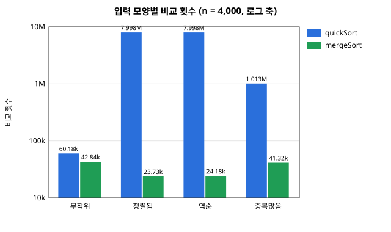
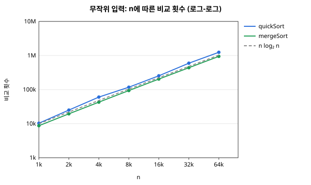
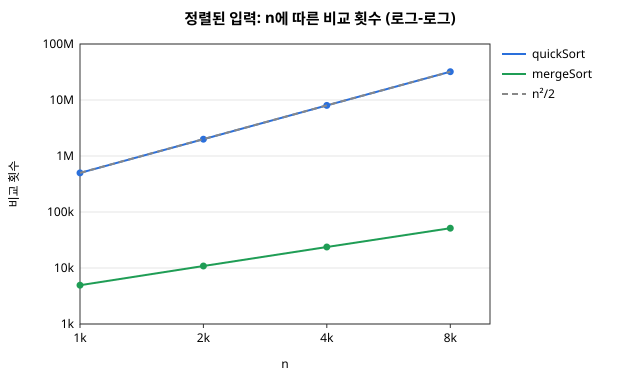
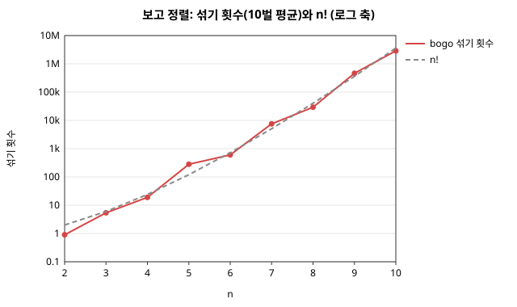

# 정렬 비교 보고서 — 퀵 · 병합 · 보고(Bogo) 정렬

2026-2 고급알고리즘(SIT2001-01) 과제 1

| 항목 | 내용 |
| --- | --- |
| 이름 / 학번 | (작성) / (작성) |
| GitHub 저장소 | <https://github.com/jiyunb314-dev/algorithm_hw1> |
| 비교한 정렬 | ① 퀵 정렬(배움) · ② 병합 정렬(배움) · ③ **보고 정렬(bogosort, 배우지 않음)** |
| 환경 | 저장소의 컨테이너(`compose.yml`) 안, `gcc -std=c17 -Wall -Wextra -O2`, Python 3 |
| 실행 | `make run`(예제) · `make test`(테스트) · `make bench`(비교 표) · `make charts`(그래프) |

---

## 1. 개요

세 정렬을 **하나의 공통 인터페이스**로 묶고, 같은 입력 · 같은 잣대로 비교 횟수,
이동 횟수, 시간, 추가 메모리, 재귀 깊이, 안정성을 쟀다.

- **퀵 정렬**과 **병합 정렬**은 둘 다 평균 `O(n log n)`이지만, 퀵 정렬은 입력에
  따라 `O(n^2)`로 무너질 수 있고 병합 정렬은 그렇지 않다. 이 차이를 실험으로 확인한다.
- **보고 정렬**은 "정렬될 때까지 무작위로 섞는다"는 정렬이다. 평균 `O(n · n!)`로
  가장 비효율적인 정렬의 대표격이다. 수업에서 다루지 않았으므로 AI(Claude)에게
  묻고 배운 내용을 [4장](#4-배우지-않은-정렬-보고-정렬--ai로-학습한-내용)에 정리하고,
  AI가 말한 내용이 맞는지를 직접 측정해 확인했다.

---

## 2. 구현

### 2.1 공통 인터페이스

C에는 `interface`가 없으므로 **함수 포인터를 담은 구조체**로 정렬 하나를 표현했다.
비교 함수는 표준 라이브러리 `qsort`와 같은 규약을 쓴다. 그래서 정렬이 원소 타입을
모르고, 측정 코드는 `(key, tag)` 두 칸짜리 원소로 **안정성까지** 잴 수 있다.

```c
/* src/sort.c — 구현 표. 정렬 하나 = 한 줄. stable은 테스트가 실측과 맞춰 본다 */
const SortAlgorithm SORT_ALGORITHMS[] = {
    /* 이름         평균 시간      메모리  안정  최대 n  함수 */
    {"quickSort", "O(n log n)", "O(1)", 0, 0,  quickSort},
    {"mergeSort", "O(n log n)", "O(n)", 1, 0,  mergeSort},
    {"bogoSort",  "O(n * n!)",  "O(1)", 0, 10, bogoSort},
};
```

측정 · 테스트 코드는 이 표만 훑으므로 세 정렬이 **똑같은 조건**에서 재진다.
보고 정렬은 `maxN = 10`을 두어, n이 그보다 크면 측정에서 건너뛴다
(n = 11이면 평균 약 4천만 번을 섞어야 한다).

### 2.2 파일 구성

- `src/sort.h` · `sort.c` · `sortctx.h` — 인터페이스, 구현 표, 비교 · 이동을 세는 공통 도구
- `src/quickSort.c` · `mergeSort.c` · `bogoSort.c` — 알고리즘 하나씩 (Python은 `src/sort.py`)
- `src/bench.c` · `main.c` — 입력 생성 · 측정 · 비교 표(`--bench`) · CSV(`--csv`)
- `tests/` — C · Python 유닛 테스트, `tools/plot.py` — CSV로 SVG 그래프 (표준 모듈만 사용)

### 2.3 무엇을 어떻게 쟀나

| 재는 것 | 방법 |
| --- | --- |
| 비교 횟수 | 정렬이 비교 함수를 부를 때마다 센다. 입력이 고정이라 **언제 돌려도 같은 값** |
| 이동 횟수 | 원소 복사 1회 = 1. 교환은 `tmp`를 거치므로 3 |
| 시간 | `clock()`, 입력 복사는 빼고 정렬만, 3회 평균. 기계마다 달라지므로 같은 표 안에서만 견준다 |
| 추가 메모리 | 입력 배열 밖에 `malloc`한 바이트 (원소 하나 = 8 B) |
| 재귀 깊이 | 실제로 들어간 최대 깊이. 스택 사용량의 대리 지표 |
| 안정성 | 정렬 뒤 같은 `key`끼리 `tag`(입력 순서)가 오름차순인지 실측 |

입력은 네 모양(무작위 · 정렬됨 · 역순 · 중복많음(값 8종류))이고, 씨앗을 고정해 매번
같은 입력을 쓴다. 보고 정렬 실험은 입력(과 섞기 씨앗)을 10벌 바꿔 가며 평균을 냈다.

### 2.4 검증

`make test`는 C 37개 · Python 8개 검사가 모두 통과한다.

- 기본 케이스(섞임 · 정렬됨 · 역순 · 중복 · 모두 같음 · 음수 · 원소 1개 · 빈 배열),
  `qsort` 결과와 대조, `n = 0..200` 크기 훑기를 **세 정렬 모두** 받는다
  (보고 정렬은 `n ≤ 10`).
- 구현 표의 `stable` 값이 실측과 일치하는지 본다.
- 이론값과의 일치: 정렬된 입력에서 퀵 정렬의 비교가 정확히 `n(n-1)/2`, 깊이가 `n`인지,
  보고 정렬이 정렬된 입력을 **섞지 않고** `n-1`번 비교로 끝내는지.
- **C와 Python이 같은 알고리즘인지**: 보고 정렬의 난수(xorshift32)를 두 언어에서 비트
  단위로 같게 만들어, 같은 입력이면 비교 · 이동 · 섞기 횟수까지 똑같이 나오게 했다.
  `make test`가 두 출력을 `diff`로 대조한다.

```console
$ make run
input:  6 2 5 1 7 3 4
quickSort 1 2 3 4 5 6 7  compares=11 moves=21 depth=4 shuffles=0
mergeSort 1 2 3 4 5 6 7  compares=14 moves=40 depth=4 shuffles=0
bogoSort  1 2 3 4 5 6 7  compares=15515 moves=121005 depth=1 shuffles=9142
(Python도 위와 글자 하나까지 같다)
```

원소 7개인데 보고 정렬만 **9,142번**을 섞었다. 이것이 이 보고서의 요약이다.

---

## 3. 알고리즘 상세 — 퀵 정렬과 병합 정렬

### 3.1 퀵 정렬 (Lomuto 분할, 마지막 원소 피벗)

피벗 하나를 골라 **피벗 이하 / 피벗 / 피벗 초과**로 나눈 뒤, 양쪽을 재귀로 정렬한다.
가장 기본형인 **마지막 원소 피벗**을 썼다. 피벗 선택 요령(중앙값 등)을
일부러 넣지 않아, 최악의 경우를 실험으로 볼 수 있게 했다.

```text
[6 2 5 1 7 3 | 4]   피벗 = 4, store = 0
 2 ≤ 4 → 교환   [2 6 5 1 7 3 4]  store = 1
 1 ≤ 4 → 교환   [2 1 5 6 7 3 4]  store = 2
 3 ≤ 4 → 교환   [2 1 3 6 7 5 4]  store = 3
 피벗을 store로  [2 1 3 | 4 | 7 5 6]   → 왼쪽 [2 1 3], 오른쪽 [7 5 6]을 재귀
```

- **추가 메모리가 없다** (교환용 원소 한 칸). 대신 재귀 스택을 쓴다.
- **불안정하다.** 교환이 멀리 떨어진 원소끼리 일어나므로 같은 값의 순서가 뒤바뀐다.
- **정렬된 입력이 최악이다.** 마지막 원소가 늘 최댓값이라 분할이 `n-1 : 0`으로 나뉘고,
  비교가 `n(n-1)/2`, 재귀 깊이가 `n`이 된다.

### 3.2 병합 정렬 (top-down)

배열을 반으로 나눠 각각 정렬한 뒤, 정렬된 두 반쪽을 **병합**한다.

```text
[6 2 5 1 7 3 4]
[6 2 5]        [1 7 3 4]          ← 반으로 나눈다 (깊이 log n)
[2 5 6]        [1 3 4 7]          ← 각각 재귀로 정렬
[1 2 3 4 5 6 7]                   ← 앞머리끼리 비교하며 작은 쪽을 내보낸다
```

- 입력이 어떤 모양이든 **반씩** 나누므로 깊이는 `⌈log₂ n⌉ + 1`, 비교는 최악에도 `O(n log n)`.
- **안정하다.** 병합에서 두 값이 같으면 왼쪽을 먼저 내보낸다(`<`이지 `<=`가 아니다).
- 대가는 **보조 배열 n칸**(`O(n)` 메모리)이다. 매 단계 원소를 보조 배열로 옮겼다가
  되돌리므로 이동 횟수도 입력 모양과 무관하게 일정하다.

---

## 4. 배우지 않은 정렬: 보고 정렬 — AI로 학습한 내용

> 이 장은 AI(Claude, Anthropic)에게 질문하며 배운 내용을 정리한 것이다. 참고한 자료는
> 과제 공지의 Wikipedia 비교표([Sorting algorithm § Comparison of algorithms](https://en.wikipedia.org/wiki/Sorting_algorithm#Comparison_of_algorithms))와
> [Bogosort](https://en.wikipedia.org/wiki/Bogosort) 문서다. AI의 답변 가운데 숫자로 확인할
> 수 있는 것은 **직접 측정해 맞춰 보았다**(4.6절).

### 4.1 보고 정렬이란?

**Q. 보고 정렬은 어떤 정렬인가?**

> A. 배열이 정렬되어 있는지 확인하고, 아니면 배열 전체를 **무작위로 섞는다**. 이것을
> 정렬될 때까지 반복한다. 이름은 영어 *bogus*(가짜의, 엉터리의)에서 왔고
> permutation sort, stupid sort, shotgun sort, monkey sort라고도 부른다. 원숭이가 타자기를
> 무작위로 두드리다 보면 언젠가 셰익스피어를 쓴다는 "무한 원숭이 정리"와 같은 발상이다.

```text
while (배열이 정렬되어 있지 않다)
    배열을 무작위로 섞는다     // Fisher–Yates 셔플
```

직접 돌려 본 예 (`[3 1 4 2]`, 이 저장소의 난수 씨앗):

```text
0회  [3 1 4 2]  → 정렬 안 됨
1회  [1 2 4 3]  → 정렬 안 됨
2회  [1 2 4 3]
3회  [3 4 2 1]
 ⋮
15회 [1 2 3 4]  → 정렬됨, 끝
```

**Q. "무작위로 섞는다"는 어떻게 구현하나?**

> A. **Fisher–Yates 셔플**을 쓴다. 뒤에서부터 `i`번째 원소를 `0..i` 중 무작위 위치와
> 바꾼다. 이렇게 하면 `n!`가지 순서가 모두 **같은 확률**로 나온다. 흔히 하는 실수인
> "매번 `0..n-1` 중에서 고르기"는 순서마다 확률이 달라 편향된다.

### 4.2 시간 복잡도

**Q. 얼마나 느린가?**

> A. 서로 다른 원소 `n`개라면, 한 번 섞었을 때 정렬된 순서가 나올 확률은 `1/n!`이다.
> 성공 확률이 `p`인 시행을 성공할 때까지 반복하는 횟수는 **기하분포**를 따르고 기댓값은
> `1/p`이므로, 기대 섞기 횟수는 **`n!`**이다. 한 번 섞는 데 `O(n)`이 드니 평균은
> **`O(n · n!)`**이다.

| 경우 | 시간 | 설명 |
| --- | --- | --- |
| 최선 | `O(n)` | 이미 정렬된 입력. 확인(비교 `n-1`번)만 하고 끝난다 |
| 평균 | `O(n · n!)` | 기대 섞기 `n!`번 × 섞기 한 번 `O(n)` |
| 최악 | **상한 없음** | 난수가 운 나쁘게 계속 틀리면 끝나지 않을 수 있다 (확률은 0에 수렴) |

**Q. 정렬 확인은 매번 `n-1`번 비교해야 하나?**

> A. 아니다. 확인은 **처음으로 어긋난 이웃**에서 멈춘다. 무작위 순서에서 처음 `k`쌍이
> 모두 올바를 확률은 `1/(k+1)!`이므로, 확인 한 번의 기대 비교 횟수는
> `1/1! + 1/2! + 1/3! + … → e − 1 ≈ 1.718`번이다. n이 커져도 거의 늘지 않는다.
> 그래서 보고 정렬의 시간은 **비교가 아니라 섞기(이동)**가 지배한다.

**Q. 끝나지 않을 수도 있는데 정렬 알고리즘이라 할 수 있나?**

> A. 무작위 보고 정렬은 **라스베이거스(Las Vegas) 알고리즘**이다. 결과는 **항상 맞지만**
> 걸리는 시간이 확률적이다(반대로 몬테카를로 알고리즘은 시간은 정해져 있고 답이 틀릴 수
> 있다). 한편 순열을 사전 순으로 **하나씩 전부 시도하는 결정적 버전**도 있는데, 이것은
> 최악에도 `n!`개 안에서 반드시 끝난다(`O(n · n!)`).

### 4.3 공간 복잡도와 안정성

> A. 제자리에서 섞으므로 추가 메모리는 **`O(1)`**이고, 재귀도 없다.
> **불안정하다.** 같은 값들이 섞인 뒤 어떤 순서로 멈출지는 우연에 달려 있다.
> 대신 같은 값이 있으면 "정렬된 순서"가 여러 개가 되므로 **빨리 끝난다.** 값별 개수가
> `m₁, m₂, …`이면 성공 확률은 `m₁! · m₂! · … / n!`이다.

### 4.4 변형들

> A. 농담처럼 만들어진 변형이 여럿 있다. **보조 정렬(bozosort)**은 전체를 섞는 대신
> 무작위 원소 두 개만 바꾼다. **보고보고 정렬(bogobogosort)**은 앞부분을 재귀적으로
> 보고 정렬로 확인해 훨씬 더 느리다. **양자 보고 정렬**은 "섞은 뒤 정렬되지 않은 우주를
> 파괴한다"는 사고 실험으로, `O(n)`이라는 농담이다.

### 4.5 왜 배울 가치가 있나

> A. 실제로 쓰는 정렬이 아니다. 그래도 ① **"나쁜 알고리즘이 얼마나 나쁠 수 있는가"의
> 기준선**이 되고, ② 무작위 알고리즘의 **기댓값 분석**(기하분포, `e − 1`)을 연습하기
> 좋으며, ③ "정답을 확인하는 것(`O(n)`)은 쉬워도 정답을 **찾는 것**은 어렵다"는 점을
> 극단적으로 보여 준다. `n!`이 얼마나 빨리 자라는지 체감하는 데도 좋다.

### 4.6 AI의 설명을 실험으로 확인하기

AI의 답변을 그대로 믿지 않고, 숫자로 확인할 수 있는 주장은 직접 쟀다
(무작위 입력 10벌 평균, [5.3절](#53-작은-n에서-세-정렬-모두--보고-정렬)).

| AI의 주장 | 측정 결과 | 판정 |
| --- | --- | --- |
| 기대 섞기 횟수는 `n!` | n = 10: 평균 **2,876,544**번 (`10!` = 3,628,800의 0.79배). n = 2~10 전체가 `n!`의 0.45~2.35배 안에 있다 | ✔ (자릿수 일치, 10벌이라 흔들림이 크다) |
| 확인 한 번의 비교는 약 `e − 1 ≈ 1.718` | 비교 ÷ 섞기 = n ≥ 6에서 **1.71~1.74** | ✔ |
| 최선은 `O(n)` | 정렬된 입력 n = 100: 비교 **99**번, 섞기 **0**번 (유닛 테스트) | ✔ |
| 불안정 | 중복 있는 입력(n = 10) 10벌 중 **안정 0벌** | ✔ |
| 중복이 있으면 빨리 끝난다 | 중복 입력 n = 10: 평균 **124,961**번 (중복 없을 때의 1/23) | ✔ |
| 시간이 확률적이다 | n = 10에서 섞기 횟수 최소 **385,753** ~ 최대 **7,200,551** (18.7배 차이) | ✔ |

특히 `e − 1`은 AI의 설명을 듣기 전에는 예상하지 못한 값이었는데, 측정값이
1.72 부근에 모여 있는 것을 보고 설명이 맞았음을 확인했다.

---

## 5. 실험 결과

아래 수치는 `make charts`가 남긴 [`results.csv`](results.csv) 한 번의 실행에서 나왔다.
비교 · 이동 횟수는 입력이 고정이라 다시 돌려도 같고, 시간(ms)만 조금씩 달라진다.

### 5.1 입력 모양별 — 퀵 vs 병합 (n = 4,000)

| 입력 | 알고리즘 | 시간(ms) | 비교 | 이동 | 추가 메모리 | 재귀 깊이 | 안정 |
| --- | --- | ---: | ---: | ---: | ---: | ---: | :---: |
| 무작위 | quickSort | **0.747** | 60,178 | **71,553** | 8 B | 29 | ✔ |
| 무작위 | mergeSort | 1.109 | **42,844** | 95,808 | 32,008 B | 13 | ✔ |
| 정렬됨 | quickSort | 30.517 | 7,998,000 | 0 | 8 B | **4,000** | ✔ |
| 정렬됨 | mergeSort | **0.677** | **23,728** | 95,808 | 32,008 B | 13 | ✔ |
| 역순 | quickSort | 23.948 | 7,998,000 | 6,000 | 8 B | **4,000** | ✔ |
| 역순 | mergeSort | **0.718** | **24,176** | 95,808 | 32,008 B | 13 | ✔ |
| 중복많음 | quickSort | 3.922 | 1,012,912 | 21,234 | 8 B | 525 | **✘** |
| 중복많음 | mergeSort | **0.928** | **41,320** | 95,808 | 32,008 B | 13 | ✔ |

(보고 정렬은 n = 4,000에서 돌릴 수 없다. `4000!`은 12,000자리가 넘는 수다.)

<p align="center"></p>

- **무작위 입력에서는 퀵 정렬이 더 빠르다**(0.75 ms vs 1.11 ms). 비교는 병합 정렬이 더 적지만,
  퀵 정렬은 이동이 적고 보조 배열을 오가지 않아 캐시에 유리하다. "실전에서 퀵 정렬이
  빠르다"는 말이 이 경우다.
- **정렬됨 · 역순에서 퀵 정렬이 무너진다.** 비교가 정확히 `n(n-1)/2` = 7,998,000이고 재귀
  깊이가 n = 4,000이다. 병합 정렬보다 **33~45배** 느리다. 병합 정렬은 오히려 무작위보다
  빨라졌다(병합에서 한쪽이 먼저 바닥나 비교가 절반으로 준다).
- **중복이 많아도 퀵 정렬이 느려진다.** Lomuto 분할은 피벗과 같은 값을 전부 한쪽으로
  보내므로, 같은 값 약 500개짜리 묶음마다 `O(m²)`이 된다(8 × 500² / 2 ≈ 1,000,000 —
  측정 1,012,912와 맞는다).
- **안정성은 퀵 정렬만 깨졌다.** 병합 정렬은 모든 입력에서 안정했다.
- **메모리는 정반대다.** 퀵 정렬은 8 B, 병합 정렬은 32,008 B(n칸 보조 배열). 대신 퀵 정렬은
  최악에 재귀 깊이 4,000만큼 스택을 쓴다.

### 5.2 n을 키우며

| n | quick 비교 | merge 비교 | quick(ms) | merge(ms) | | quick 비교 (정렬됨) | merge 비교 (정렬됨) |
| ---: | ---: | ---: | ---: | ---: | --- | ---: | ---: |
| 1,000 | 10,311 | 8,713 | 0.164 | 0.210 | | 499,500 | 4,932 |
| 2,000 | 24,997 | 19,449 | 0.353 | 0.515 | | 1,999,000 | 10,864 |
| 4,000 | 60,178 | 42,844 | 0.742 | 1.093 | | 7,998,000 | 23,728 |
| 8,000 | 117,355 | 93,666 | 1.661 | 2.225 | | 31,996,000 | 51,456 |
| 16,000 | 253,671 | 203,238 | 3.541 | 5.097 | | — | — |
| 32,000 | 593,903 | 438,500 | 7.855 | 10.227 | | — | — |
| 64,000 | 1,243,283 | 941,022 | 16.355 | 21.880 | | — | — |

<p align="center"></p>

로그-로그 축에서는 **기울기가 곧 복잡도의 지수**다.

- 무작위 입력: 퀵 **1.15**, 병합 **1.13**. 같은 구간에서 `n log n`의 기울기가 1.11이므로
  둘 다 `n log n`으로 자란다. 비교 횟수는 병합 ≈ 0.9 · n log₂ n, 퀵 ≈ 1.2 · n log₂ n이다.

<p align="center"></p>

- 정렬된 입력: 퀵 정렬의 기울기가 **2.00**으로 `n²/2` 점선과 겹친다. 병합 정렬은 여전히
  1.13이다. n = 8,000에서 퀵 정렬 123 ms, 병합 정렬 1.5 ms로 **84배** 차이다.
  n이 두 배가 될 때마다 격차도 거의 두 배가 된다(비교 횟수 비 101 → 184 → 337 → 622배).

### 5.3 작은 n에서 세 정렬 모두 — 보고 정렬

n = 2 ~ 10, 무작위 입력 10벌(서로 다른 입력 · 다른 섞기 씨앗) 평균.

| n | n! | bogo 섞기(평균) | 최소 ~ 최대 | bogo 비교 | bogo(ms) | quick 비교 | merge 비교 |
| ---: | ---: | ---: | ---: | ---: | ---: | ---: | ---: |
| 2 | 2 | 0.9 | 0 ~ 4 | 1.9 | 0.0003 | 1.0 | 1.0 |
| 3 | 6 | 5.4 | 0 ~ 21 | 9.9 | 0.0005 | 2.7 | 2.6 |
| 4 | 24 | 18.9 | 0 ~ 48 | 32.8 | 0.0016 | 4.8 | 4.8 |
| 5 | 120 | 281.6 | 14 ~ 1,689 | 475.9 | 0.020 | 6.8 | 7.2 |
| 6 | 720 | 601.1 | 103 ~ 2,447 | 1,043.3 | 0.052 | 10.2 | 10.1 |
| 7 | 5,040 | 7,526.9 | 224 ~ 26,628 | 12,902.5 | 0.77 | 12.5 | 12.6 |
| 8 | 40,320 | 29,249.6 | 2,249 ~ 98,224 | 50,173.9 | 3.41 | 16.7 | 16.2 |
| 9 | 362,880 | 463,506.7 | 55,412 ~ 1,262,506 | 796,035.6 | 60.75 | 21.9 | 19.9 |
| 10 | 3,628,800 | 2,876,544.3 | 385,753 ~ 7,200,551 | 4,942,485.8 | **411.49** | **24.4** | **22.8** |

<p align="center"></p>

- 섞기 횟수가 `n!` 점선을 따라 올라간다. 로그 축에서 직선이 아니라 **점점 가팔라지는**
  곡선이다 — 지수 함수보다도 빠르게 자란다는 뜻이다.
- 최소와 최대가 **10배 이상** 벌어진다. 같은 n이라도 운에 따라 시간이 크게 다르다.

- **n = 10, 원소 10개**를 정렬하는 데 보고 정렬은 **411 ms**, 퀵 · 병합 정렬은 **0.001 ms**
  남짓이다. **수십만 배** 차이다(이 정도로 짧은 시간은 `clock()`로 정확히 재기 어려워,
  비교 횟수로 보는 편이 낫다). 비교 횟수로는 494만 번 대 23번, 약 **20만 배**다.
- 5.1절에서 퀵 정렬이 **n = 4,000 최악의 경우**에 걸린 시간(30 ms)보다, 보고 정렬이
  **원소 10개**에 쓴 시간이 약 13배 길다.
- n = 11이면 기대 약 4천만 번, n = 12면 약 4억 8천만 번을 섞어야 한다. 한 번에 약 140 ns가
  들었으니 n = 12는 약 1분, n = 15는 약 **2일**, n = 20은 **1만 년**이 넘는다.

---

## 6. 종합 비교와 결론

| | 퀵 정렬 | 병합 정렬 | 보고 정렬 |
| --- | --- | --- | --- |
| 최선 시간 | `O(n log n)` | `O(n log n)` | `O(n)` (이미 정렬됨) |
| 평균 시간 | `O(n log n)` | `O(n log n)` | `O(n · n!)` |
| 최악 시간 | `O(n²)` (정렬된 입력 등) | `O(n log n)` | 상한 없음 |
| 추가 메모리 | `O(1)` + 스택 `O(log n)`~`O(n)` | `O(n)` | `O(1)` |
| 안정성 | ✘ | ✔ | ✘ |
| 입력 모양에 민감한가 | **매우 민감** | 민감하지 않음 | 정렬 여부 · 중복 수에만 |
| 실측 요약 | 무작위에서 가장 빠름 (n = 64,000: 16 ms) | 모든 입력에서 고르게 빠름 (최악 없음) | n = 10에 0.4초, 그 이상은 불가능 |
| 알맞은 곳 | 메모리가 빠듯하고 입력이 무작위일 때 | 최악을 보장해야 할 때, 안정성이 필요할 때 | 교육용 반면교사 |

1. **퀵 정렬은 평균적으로 가장 빠르지만 최악이 있다.** 무작위 입력에서 병합 정렬보다
   약 1.3~1.5배 빨랐다. 그러나 이미 정렬된 입력에서는 `O(n²)`로 무너져 n = 8,000에서 84배
   느려졌고, 재귀 깊이가 n까지 가서 n이 더 크면 스택이 넘칠 수 있다. 실무 구현이
   피벗을 무작위 · 세 값의 중앙값으로 고르고, 중복을 세 갈래로 나누는(3-way partition)
   이유를 측정으로 확인했다.
2. **병합 정렬은 느리지 않으면서 예측 가능하다.** 모든 입력에서 비교 ≈ `n log n`, 깊이
   `log n`으로 일정했고 유일하게 안정했다. 대가는 `O(n)` 보조 메모리다.
3. **보고 정렬은 "확인은 쉽지만 찾기는 어렵다"를 극단적으로 보여 준다.** 정렬 여부
   확인은 평균 1.72번 비교면 끝나지만, 맞는 순서를 우연히 찾으려면 `n!`번을 섞어야 한다.
   원소 10개에 0.4초, 20개면 1만 년이다. `O(n log n)`과 `O(n · n!)`의 차이가 "조금 느림"이
   아니라 **"끝나느냐 마느냐"**의 차이라는 것을 숫자로 체감했다.

---

## 7. 한계

- 시간은 한 기계에서 잰 값이라 다른 환경에서는 달라진다. 그래서 재현되는 비교 · 이동 횟수를 함께 실었다.
- 보고 정렬은 10벌 평균이라 흔들림이 크다(평균이 `n!`의 0.45~2.35배). 회차를 늘리면 `n!`에 가까워질 것이다.
- 퀵 정렬은 최악을 보이려고 기본형(마지막 원소 피벗)을 썼다. 무작위 · 중앙값 피벗이나 3-way 분할을 쓰면 5.1절의 최악 사례 대부분이 사라진다.
- 재귀 스택은 추가 메모리에 세지 않고 재귀 깊이로 따로 실었다.

## 참고 자료

- Wikipedia, *Sorting algorithm — Comparison of algorithms*.
  <https://en.wikipedia.org/wiki/Sorting_algorithm#Comparison_of_algorithms>
- Wikipedia, *Bogosort*. <https://en.wikipedia.org/wiki/Bogosort>
- Wikipedia, *Fisher–Yates shuffle*. <https://en.wikipedia.org/wiki/Fisher%E2%80%93Yates_shuffle>
- 과제 샘플: <https://github.com/lec-algorithm/hw1-sample-2026>
- 보고 정렬 학습에 사용한 AI: Claude (Anthropic) — 4장의 질의응답
